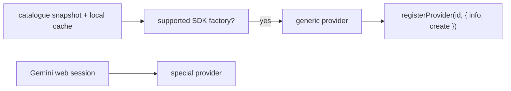
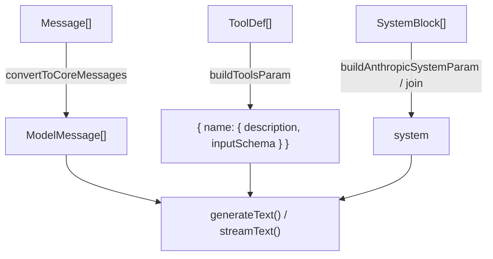

# Provider layer

Every model vendor has its own wire format, its own name for a tool call, its
own way of reporting what you were billed, and its own theory of prompt caching.
The provider layer's job is to make all of that invisible: the
[agent loop](/internals/agent-loop) asks for a stream of chunks and gets a
stream of chunks, and it never names a vendor.

The layer is thin on purpose. It does **not** reimplement HTTP clients — the
[Vercel AI SDK](https://sdk.vercel.ai) does that. What lives here is the part
the SDK can't decide for you: which prefix to cache, how long to wait before
declaring a request dead, what a token count means, and who owns retries.

## The contract

```ts
interface AIProvider {
  info: ProviderInfo;
  execute(opts: ExecuteOptions): Promise<ExecuteResult>;
  stream?(opts: ExecuteOptions): AsyncIterable<ProviderChunk>;
}
```

That's it (`providers/types.ts:117`). `stream` is optional; the loop prefers it
when present and silently uses `execute` otherwise.

| Type | Carries |
| --- | --- |
| `ProviderInfo` | `id`, `name`, `defaultModel`, `supportsStreaming`, `supportsTools`, `maxOutputTokens` |
| `ExecuteOptions` | `messages` or `prompt`, `system`, `model`, `tools`, `maxTokens`, `temperature`, `abortSignal`, `sessionId` |
| `ExecuteResult` | `content`, `thinking?`, `toolCalls?`, `usage?`, `stopReason`, `provider`, `model` |
| `ProviderChunk` | `text_delta` · `thinking_delta` · `tool_call` · `usage` · `done` · `error` |

Two fields on `ExecuteOptions` are less obvious than they look:

- **`sessionId`** is a *cache-routing hint*, not bookkeeping. OpenAI shards its
  prompt cache across machines and routes on this key, so a stable one per
  conversation keeps a session's turns landing where its own prefix is already
  warm. Providers that cache without a routing key ignore it. Subagents pass
  their own id deliberately — a different context should not be routed to the
  parent's cache.
- **`quietModelFallback`** exists because "no model specified, using the
  default" is a warning you want *once*, from a caller that meant it (memory
  extraction picks the provider's cheap default on purpose), and loudly from one
  that didn't.

## The provider catalogue



FreeCode does not maintain one adapter file per vendor. At startup,
`initProviders()` reads a generated **models.dev catalogue snapshot**, overlays a
locally cached catalogue when available, and registers every entry for which
FreeCode ships an SDK factory — about 198 API-key providers at the time of
writing. The SDK and credentials are loaded only when you actually make a
request, so having a large catalogue does not make an ordinary session slower.

The familiar providers — Anthropic, OpenAI, Gemini, MiniMax, DeepSeek, and Z.ai
— are featured defaults, not the complete support list. `gemini-web` is the
one intentional exception: it uses a signed-in Gemini web session and its own
direct protocol instead of the API-provider catalogue.

The important behavioural fork in the layer is the request shape.
**Anthropic-shaped** providers get `SystemBlock[]` mapped to
`{ role: "system", content, providerOptions }` parts so individual blocks can
carry a cache breakpoint. **OpenAI-shaped** providers get the blocks joined
with `\n\n` into one string, because their caching is automatic and there is
nothing to mark.

## Building a request



**Messages.** `convertToCoreMessages` (`utils.ts:271`) does one structurally
important thing: an assistant turn that called tools becomes *two* SDK messages
— an `assistant` message holding the `tool-call` parts, then a `tool` message
holding the `tool-result` parts. Providers require that pairing, and getting it
wrong fails the whole request, not just the turn.

It also carries the last line of defence for tool arguments: `tool_use.input`
must be a dictionary, and a session recorded before the streaming-layer guard
existed can still hold a raw JSON *string* there. One bad entry anywhere in
history fails every later request in that session, so a non-object is replaced
with `{}` rather than allowed to brick the conversation.

**Tools.** `buildToolsParam` wraps each schema in the SDK's own `jsonSchema()`
helper instead of passing a raw object. The SDK's `asSchema()` sniffs for a
`"~standard"` marker to detect Zod, and otherwise **calls the object as a
function** — which throws `H is not a function` for a plain JSON Schema object.
Tagging it removes the guesswork.

It also marks the **last** tool with a cache breakpoint. Anthropic caches
everything up to and including a marked block, so one marker on the final tool
caches the entire tools array — which would otherwise be billed as full-price
input on every single turn, right next to a cached system prompt. Tool defs are
sorted by name (`tools/defs-cache.ts`) precisely so that "last" is stable.

## Prompt caching

This is where most of the layer's thinking went, because it is where most of
the money is.

A provider cache matches on an **exact byte prefix**. If byte 40,000 of a
100,000-token request changes, everything after it is re-billed at the write
rate (1.25×) instead of the read rate (~0.1×). So the entire design goal is:
*make the front of the request stop moving.*

### Where the breakpoints go

`applyMessageCaching` (`utils.ts:202`) marks **two** anchors, and the second one
is the subtle half:

- **Write anchor** — the last message. Stores this request's full prefix for
  next time.
- **Read anchor** — the message immediately *before* the newest assistant
  message. That is exactly where the previous request ended, and therefore the
  only prefix an entry was ever written for.

A marker on the tail alone can only ever *write* an entry, never read one: it
describes a prefix ending in content the model has never seen.

The obvious rule — "mark the last two messages", which is what opencode does —
is wrong here, because `convertToCoreMessages` expands one turn into two
messages. A `.slice(-2)` lands on two messages that are *both new*. Measured on
MiniMax-M3: cache reads pinned at ~7K (just the system prefix) while input grew
to 81K, never scaling with history.

### Which providers get markers

```ts
{
  anthropic:        { cacheControl: { type: "ephemeral", ttl? } },
  openrouter:       { cacheControl: { type: "ephemeral", ttl? } },
  openaiCompatible: { cache_control: { type: "ephemeral" } },
  alibaba:          { cacheControl: { type: "ephemeral" } },
  bedrock:          { cachePoint:   { type: "default" } },
}
```

All of them at once. The SDK routes `providerOptions` by key and ignores the
rest, so setting every flavour costs nothing and means a model reached through
OpenRouter or a compatible gateway caches as well as a direct Anthropic one.
`ttl` rides along only on the two whose acceptance is verified — an unrecognised
field on a raw gateway passthrough risks a 400 on the primary path to buy
nothing.

### TTL

`FREECODE_CACHE_TTL=1h` opts into Anthropic's extended cache; anything else is
the 5-minute default. The trade is a higher write rate (1.25× → 2×) against far
fewer *cold* writes, and the number that dominates is how often the whole
context is re-written from scratch. At 5m that's every pause longer than a
coffee refill — one such gap an hour already makes 1h cheaper, since 2× once
beats 1.25× twice. It is off by default because the reverse case is equally
real: a fast unattended run with no gaps pays 2× for durability it never uses.

At 5m the `ttl` field is omitted entirely rather than sent explicitly. 5m is
already the server-side default, so omitting it keeps the request bytes
identical to what shipped before the knob existed — the default path cannot
regress.

### Debugging a cache that stopped working

When the hit rate drops the question is always *which segment moved*, and
counters cannot answer it. `FREECODE_DEBUG_CACHE=1` writes a length + hash
fingerprint of every cacheable segment to **stderr** (not the logger — core
speaks JSON-RPC over stdout, so a `console.log` there is swallowed by the
frontend's protocol reader). Diff two consecutive turns; whichever hash changed
is the one breaking the prefix.

## Stream normalization

`normalizeAiSdkStream` (`streaming.ts:27`) is the one transform every AI-SDK
provider shares. It maps the SDK's `fullStream` parts onto six `ProviderChunk`
types and drops the rest.

| SDK part | Becomes |
| --- | --- |
| `text` / `text-delta` | `text_delta` |
| `reasoning` / `reasoning-delta` | `thinking_delta` |
| `tool-call` | `tool_call` (whole, once arguments are complete) |
| `finish` | `usage`, then `done` |
| `error` | `error` |
| `tool-input-start` / `-delta` / `-end`, `start`, `step-*` | dropped |

Two bugs are frozen into this file as comments, and both are worth knowing:

**Malformed tool arguments are fatal on purpose.** When a model's tool-call JSON
can't be parsed — usually because the output-token cap truncated it mid-argument
— the SDK does not throw. It emits a `tool-call` part whose `input` is the *raw
JSON string*, flagged `invalid: true`. Casting that to a `Record` poisons the
session permanently: the string is stored in history, reloaded on resume, and
re-sent every turn as `tool_use.input`, which providers reject — so every
subsequent request fails before reaching the model. The normalizer fails the
turn instead, while the damage is still recoverable.

**Usage lives on `totalUsage`, not `usage`.** The `finish` part of `fullStream`
carries `totalUsage`; the `usage` field exists only on the per-step
`finish-step` part. Reading `chunk.usage` there was always `undefined`, so no
usage chunk was ever emitted and every streamed turn reported zero tokens.

## Usage normalization

`mapUsage` (`provider-shared.ts:186`) turns the SDK's `LanguageModelUsage` into
one **additive** shape where every field is independently meaningful, so no
consumer ever has to subtract:

```
nonCachedInputTokens + cacheReadInputTokens + cacheWriteInputTokens === inputTokens
reasoningTokens <= outputTokens
```

The two rules that matter downstream:

- **`inputTokens` is inclusive.** Cache reads and cache writes are already
  folded in. Adding cache writes back on top was a real double-count against
  Anthropic, whose wire payload reports `input_tokens` as the *non-cached*
  portion only — the SDK adapter is what makes it inclusive.
- **`outputTokens` is inclusive of reasoning** where the provider merges them
  (Anthropic does not break extended thinking out at all, so
  `reasoningTokens` is simply `undefined` there).

Helpers return `undefined` rather than `0` when nothing is known, so "we have no
usage data" stays distinguishable from "a real zero". `safe()` clamps negatives,
because OpenAI Chat Completions has been observed reporting negative
`cached_tokens` against a stale cache.

`providerMetadata` — the raw `{ anthropic: … }` / `{ openai: … }` envelope — is
passed through untouched for billing audit and for fields not yet normalized.

## Timeouts

Timeouts live at the **fetch layer** (`fetch-timeout.ts`), wired as the `fetch`
option on every provider factory. Two independent bounds:

| Bound | Default | Env | Fires when |
| --- | --- | --- | --- |
| Header | 300s | `FREECODE_HEADER_TIMEOUT_MS` | the provider hasn't answered *at all* |
| SSE stall | 180s | `FREECODE_SSE_STALL_TIMEOUT_MS` | a live stream goes fully silent |

`0` disables either. The header timer is cleared the instant headers arrive, so
it never constrains generation time; the stall bound is not a token budget, and
a slow model that keeps the socket warm survives it indefinitely.

**Why not higher up.** The first version bounded silence between
`ProviderChunk`s — downstream of `normalizeAiSdkStream`, which drops
`tool-input-delta`. A model writing a large file produces a continuous stream at
the wire and *total silence* at that measurement point, so the guard aborted
perfectly healthy requests mid-write. Thinking phases and keep-alives were
invisible for the same reason. Liveness has to be measured where the bytes are.

An abort surfaces from `fetch` as a generic `DOMException`, so the wrapper
restates it as `HeaderTimeoutError` / `StreamStallError` — the log and the user
get a cause instead of the word "aborted". `isTimeoutError()` is what lets the
loop record a stall as `kind: "stall"` in the trace.

## Retries belong to exactly one place

```ts
export const PROVIDER_MAX_RETRIES = 0;   // utils.ts:429
```

The SDK defaults to 2 retries and treats *every* 429 as retryable — including a
hard "you are out of credits" rejection that can never succeed. Worse, its
attempts multiply with ours: 3 of its own against the 429 policy's 5 is up to
**15 full-conversation round trips for one turn**.

Setting it to 0 puts every retry decision in `RecoveryManager`, where a quota
error can be told from a transient rate limit and the provider's own
`retry-after` header is honoured. See
[the agent loop's recovery table](/internals/agent-loop#3-the-provider-call).

## Model metadata

Context windows, output ceilings, and vision support come from
[models.dev](https://models.dev), cached in `~/.freecode/cache/models-dev.json`
with a 5-minute TTL and a stale-disk fallback when the network fails
(`models-dev.ts`).

**`resolveMaxOutputTokens(provider, model)`** is the important one. Providers
charge `max_tokens` against the *same* context window as the input, so the
reservation is subtracted twice: once from what the conversation may occupy, and
again by the API when it validates the request. It must be the same number at
both sites — which is why compaction and the request builder call the identical
function. Sending one number while budgeting against another is how a session
gets rejected at a threshold it believed it was under.

```
reserve = min(models.dev output limit || 32K, OUTPUT_TOKEN_CAP = 32K)
```

`OUTPUT_TOKEN_CAP` was 64K. A fixed reservation is regressive — 64K is 6% of a
1M window but a *third* of MiniMax-M2's 196K one, which dragged auto-compaction
down to firing at 60% occupancy. 32K matches opencode's `OUTPUT_TOKEN_MAX` and
is still ~128KB of output, far more than a single file write needs.

**`modelSupportsImages`** reads per-model modalities rather than keeping a
provider allowlist, because vision is a model capability: Anthropic ships
text-only models and text-first providers ship vision models. Unknown models
return `false` — sending an image part to a text-only model is a hard 400, so
failing closed with an actionable message beats a request that dies on the wire.

## Cache observability

Three cooperating pieces, all pure bookkeeping with no provider calls:

**Cold warning** (`cache-awareness.ts`). Tracks the last send per session and
warns *before* a request that will miss because more than the TTL has elapsed.
Emitted as `cache_status: "cold"`; never blocks the send.

**Invalidation journal** (`cache-invalidation.ts`). Code that knowingly changes
the cached prefix — compaction rebuilding history, a hook rewriting the system
prompt — records why, at the site that does it. Bounded to 16 entries with a
60-second attribution window.

**Miss detector** (`cache-miss.ts`). After each response, compares cache reads
against the prefix the previous call left cached:

| Symptom | Meaning |
| --- | --- |
| read = 0 with a prior cached prefix | the cache wasn't read at all |
| `read < previous cached prefix` | bytes at an earlier position changed |

A prefix can only grow, so reading less than was cached is proof something
mutated an already-sent message. If the journal explains it, the miss is logged
at debug and nothing alarms; if it doesn't, the user gets a warning with a token
count attached.

> The inversion is the whole point. An **empty** journal around a
> harness-caused miss is itself the signal: something changed the prompt without
> saying why. The two worst token-efficiency bugs in this codebase were exactly
> that, and both were found by hand, months later.

Compaction bumps a **generation** counter, so the rebuild it necessarily causes
is never reported as a bust.

## Adding a provider

Most providers arrive through models.dev automatically. Refresh the shipped
offline catalogue with `pnpm gen:catalogue`; FreeCode registers the new entry
when its SDK package has a factory in `sdk-factories.ts` and it authenticates
with a plain API key.

Add a catalogue override only when FreeCode has verified a necessary difference
from models.dev, such as a custom endpoint, a safe default model, or a request
shape. Add a bespoke provider only for a genuinely different authentication or
transport path — `gemini-web` is the example. That keeps vendor-specific code
out of the agent loop.

Expect quirks. Some models stringify numeric tool arguments, which is why
`coerceArgs` exists in the tool orchestrator and why every schema property needs
an explicit `type`.

## Known gaps

1. **`ProviderRegistryTag` has no consumer.** It is defined
   (`effect/context.ts:60`) and wired into both the live and test layers
   (`effect/layers.ts:68`, `:182`), but nothing ever resolves it — the loop calls
   `getProvider()` directly, so the DI seam that would let a test swap the
   provider registry is inert.
2. **`summarizeCache`'s hit ratio is wrong and unused.** It computes
   `read / (read + inputTokens)` (`cache-awareness.ts:71`) treating `inputTokens`
   as the fresh portion — but the normalized shape makes it *inclusive* of cache
   reads and writes, so reads are double-counted in the denominator and the ratio
   is understated. Nothing outside its own test reads the field; the loop
   destructures only `readTokens` and `writeTokens`. The test asserts the old
   non-inclusive semantics.
3. **A total cache failure is the one thing the detector can't see.** The loop's
   `emitCacheWarm` returns early when reads *and* writes are both zero
   (`loop.ts:1910`), so `checkCacheUsage` is never called — and its own
   `!reportsCache` branch would bail anyway. The `expected_read_missing` case is
   reachable only when a write happened. "Caching stopped entirely" is exactly
   the failure worth alarming on.
4. **Only `anthropic` counts as a caching provider for the cold warning.**
   `CACHING_PROVIDERS` (`cache-awareness.ts:24`) is a one-element set, yet
   `minimax` and `zai` go through the same Anthropic endpoint shape and carry the
   same `cacheControl` markers. Their users never see the cold-cache warning.
5. **A changing tool set busts the cache with no journal entry.** When an MCP
    server connects or disconnects, `invalidateToolDefs()` rebuilds the tools
    array; the tools block sits in the cached prefix, so the next request must
    miss. Nothing calls `recordInvalidation`, so the miss detector reports it as
    an unexplained bust — the exact false positive the journal exists to prevent.
6. **`ExecuteResult.thinking` is dead on the generic non-streaming path.**
    Reasoning reaches the loop only as
    `thinking_delta` chunks on the streaming path. A non-streaming turn silently
    loses extended thinking, and there is no way to configure a thinking budget
    or reasoning effort anywhere in `ExecuteOptions`.
7. **`ProviderInfo.maxOutputTokens`'s documentation is stale.** Its comment
    (`types.ts:10`) says compaction subtracts it from the context limit;
    compaction actually subtracts `resolveMaxOutputTokens()`, which reads
    models.dev and caps at 32K. The field is only a fallback for callers that
    omit `maxTokens`, and it is often the generic 4096 fallback.
8. **`session/normalize/` is unreachable.** The v4 spec describes a
    `ProviderResponseNormalizer` as a separate layer with per-provider modules;
    nothing in the codebase imports it. Normalization actually happens in
    `streaming.ts` plus `mapUsage`. The directory includes a second, independent
    `[TOOL_CALLS]` parser that duplicates the one in `loop.ts`.
9. **`browser/` has zero importers.** `CLAUDE.md` calls the Playwright path
    "legacy / not wired into the primary path" — it is in fact unreachable: no
    file outside the directory imports anything from it, and `chatgpt` is not in
    the provider registry. It is dead code, not a fallback.

## Where to look

| You want | File |
| --- | --- |
| The interface and every wire type | `apps/core/src/providers/types.ts` |
| Registration and lookup | `apps/core/src/providers/registry.ts` |
| Message/tool/system conversion, cache anchors, TTL | `apps/core/src/providers/utils.ts` |
| Chunk normalization | `apps/core/src/providers/streaming.ts` |
| Token-usage normalization | `apps/core/src/providers/provider-shared.ts` |
| Header + SSE-stall bounds | `apps/core/src/providers/fetch-timeout.ts` |
| Cold-cache warning, hit summary | `apps/core/src/providers/cache-awareness.ts` |
| Documented invalidations | `apps/core/src/providers/cache-invalidation.ts` |
| Miss detection | `apps/core/src/providers/cache-miss.ts` |
| API keys, config.json, fallback chain | `apps/core/src/providers/config.ts` |
| Context windows, output limits, vision | `apps/core/src/models-dev.ts` |
| Catalogue resolution and overrides | `apps/core/src/providers/catalogue.ts` |
| Generic API provider | `apps/core/src/providers/generic-provider.ts` |
| SDK factories | `apps/core/src/providers/sdk-factories.ts` |
| Gemini web-session provider | `apps/core/src/providers/gemini-web/` |

Related: [Agent loop](/internals/agent-loop) for who calls this and how retries
and fallback work, [Compaction](/internals/compaction) for the budget that
`resolveMaxOutputTokens` feeds, [Tool system](/internals/tools) for where tool
schemas come from, and [Adding a provider](/contributing/adding-a-provider) for
the contributor-facing walkthrough.
